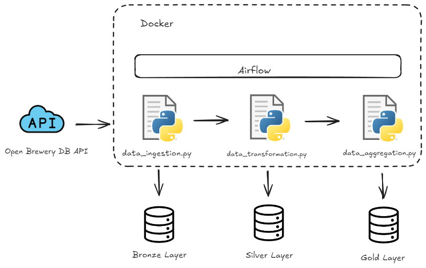

**BEES_CASE**

This project is a data engineering case study that involves building a data pipeline to ingest, transform, aggregate, and visualize data from the Open Brewery DB API. The pipeline is orchestrated using Apache Airflow and Docker Compose, ensuring modularity, scalability, and reproducibility.

**PROJECT OVERVIEW**

The main goal of this project is to create an end-to-end data pipeline that:

- ​	Ingests data from the Open Brewery DB API.
- ​	Transforms the raw data and saves it in a structured format.
- ​	Aggregates the transformed data for analytical purposes.
- ​	Visualizes the aggregated data to derive insights.

The pipeline follows the best practices of data engineering, including:

- ​	Medallion architecture (Bronze, Silver, Gold layers).
- ​	Modularity and code reusability.
- ​	Proper logging and exception handling.
- ​	Data partitioning and efficient storage formats.

**DATA PARTITION** 

- The partitioning was done using the country and state of the brewery, due to the discrepancy in values between the U.S. and other countries. Partitioning by state helps prevent issues related to data skew.

**PREREQUISITES** 

- Docker and Docker Compose installed on your machine.
- An internet connection to access the Open Brewery DB API.

**INSTALLATION** 

1. Clone the Repository (git clone https://github.com/Cerresi/bees_case.git)
2. Build and Start the Docker Containers (docker compose up --build)
3. All dependencies are listed in the requirements.txt file

**MONITORING AND ALERTS** 

It is possible to configure Airflow to send emails when there is a failure in the pipeline. To achieve this, you need to set up the SMTP (Simple Mail Transfer Protocol) settings in Airflow:

SMTP Configuration: Define your SMTP server details in the 'airflow.cfg' file or via environment variables.

DAG Email Settings: In the DAG's default arguments, specify the email settings to receive notifications on failures.

**CONTACT**

Author: Lucas Cerresi dos Santos

Email: cerresi@gmail.com

GitHub: https://github.com/cerresi
